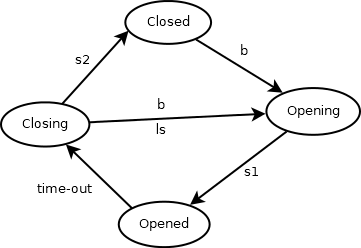

# Treść

Zaimplementuj logikę drzwi automatycznych.

Stany:

- Closed - drzwi są zamknięte. Stan bezczynny.

- Opening - drzwi się otwierają. Poprzednio były Closed, ale jeszcze nie są w stanie Open.
- Open - drzwi są chwilowo otwarte
- Closing - drzwi się zamykają, ale jeszcze nie są Closed

Zdarzenia:
- b - przycisk otwierania został wciśnięty
- s1 - pojawia się, gdy czujnik S1 jest aktywowany, czyli gdy drzwi zostaną finalnie otwarte
- s2 - gdy czujnik S2 jest aktywowany, czyli gdy drzwi zostaną finalnie zamknięte
- ls - gdy linia drzwi zostaje przekroczona
- time-out - gdy minimalny czas otwartych drzwi zostanie przekroczony

Akcje:

- open - uruchamia silnik otwierający drzwi

- stop - zatrzymuje silnik niezależnie od pozycji drzwi

- close - uruchamia silnik zamykający drzwi

- start - uruchamia timer otwartych drzwi, finalnie generuje zdarzenie time-out

DoorSimulator (a jednocześnie kontekst dla stanów) powinien implementować metody:
- open
- stop
- close
- start

Interfejs klienta (Client) powinien udostępniać metody:
- buttonPressed(DoorSimulator door)
- sensor1Reached(DoorSimulator door)
- sensor2Reached(DoorSimulator door)
- doorline(DoorSimulator door)
- timeout(DoorSimulator door)

Źródło: https://web.ti.bfh.ch/~due1/courses/c355/exercises/state/

